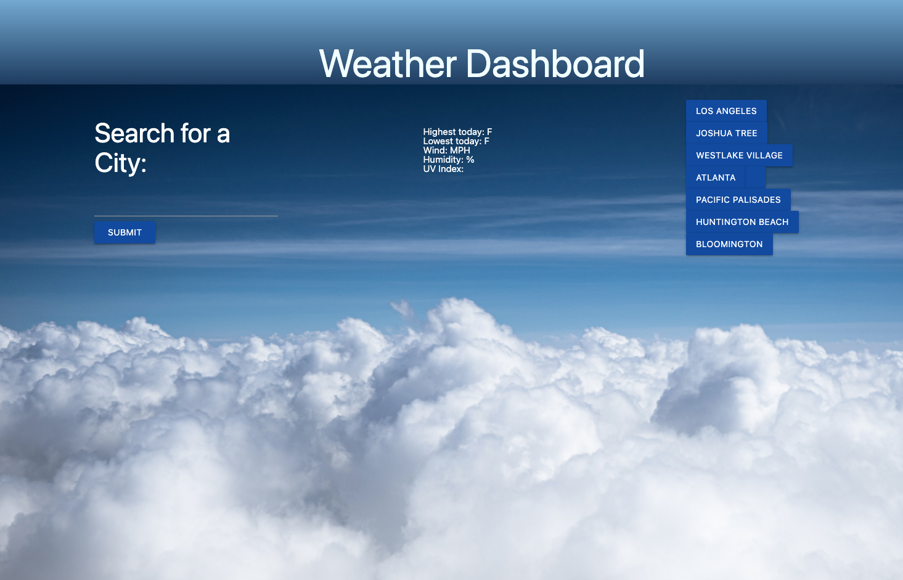
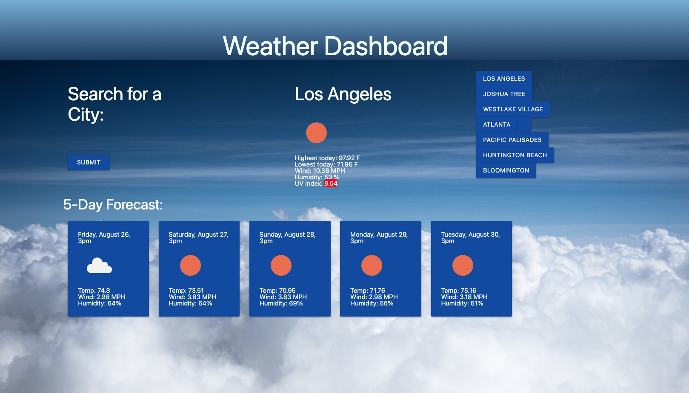

# Weather-API-Dashboard

## Description

- What was your motivation?
    My motivation behind this project was to utilize a web server API to gather data and populate my HTML page. To use a framework I had not yet used. To use javascript commands that felt uncomfortable for me to use. 
- Why did you build this project?
    I built this project in order to practice styling using materialize which was a framework that I havent used before. Practice and showcase my abilites in being able to work with webserver API's. I also wanted to challenge myself with the use of local storage which was once was a challenge for me to master. 
- What problem does it solve?
    Some of the problems in my code was using Materialize as well as trying to use an API then using day.js to format a date given from the weather API. It used local storage which was a challenge for me before using this assignment to populate buttons of previous searches from the user and the user can click those buttons to then search the weather for the cities that they are intrested in. 
- What did you learn?
    I learned how to effectivily use a fetch request in JavaScript, I also was able to parse data from the API to manipulate it using. I learned how to use Materalize my layout. I challenged myself to go above and beyond with the styling of the page.  

## Installation

In order to use the webpage, click on the URL link below. 

https://alejandraquintero018.github.io/Weather-API-Dashboard/

## Usage

As the user you want to check the weather, you enter the name of the city that you want to check the weather for. The webpage will populate the weather for the day and give you a five day weather forecast. The webpage will then make a button from the city that you searched for and as the user, you can click on that button to search for that city weather without having to type in the city again. 

## Credits

I used this page to help me get the styling of the header. 
https://www.w3schools.com/css/css3_gradients.asp

I met with Irina Kudosova Saturday, August 13, 2022 to help me get the API to work 

I used materalize for the layout of my project 
https://materializecss.com/

I referenced this website to learn how to populate an image into my HTML 
https://www.geeksforgeeks.org/how-to-create-an-image-element-dynamically-using-javascript/

## License
MIT License

Copyright (c) [2022] [Alejandra Quintero]

Permission is hereby granted, free of charge, to any person obtaining a copy
of this software and associated documentation files (the "Software"), to deal
in the Software without restriction, including without limitation the rights
to use, copy, modify, merge, publish, distribute, sublicense, and/or sell
copies of the Software, and to permit persons to whom the Software is
furnished to do so, subject to the following conditions:

The above copyright notice and this permission notice shall be included in all
copies or substantial portions of the Software.

THE SOFTWARE IS PROVIDED "AS IS", WITHOUT WARRANTY OF ANY KIND, EXPRESS OR
IMPLIED, INCLUDING BUT NOT LIMITED TO THE WARRANTIES OF MERCHANTABILITY,
FITNESS FOR A PARTICULAR PURPOSE AND NONINFRINGEMENT. IN NO EVENT SHALL THE
AUTHORS OR COPYRIGHT HOLDERS BE LIABLE FOR ANY CLAIM, DAMAGES OR OTHER
LIABILITY, WHETHER IN AN ACTION OF CONTRACT, TORT OR OTHERWISE, ARISING FROM,
OUT OF OR IN CONNECTION WITH THE SOFTWARE OR THE USE OR OTHER DEALINGS IN THE
SOFTWARE.

## Features

When the user enters a city name, they are then given the 

